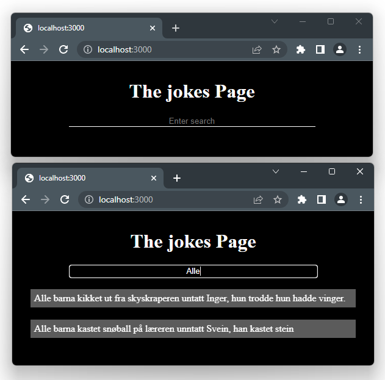

## Generell Info
Kjør følgende kommando for å få alle pakkene-du trenger:
npm install

# Vitse-system med søk
Systemet gjør det mulig å søke i en mengde med vitser.

På fremsiden er det et søkefelt. En eventlistener er lagt til dette
søkefeltet slik at søk sendes til serveren hver gang noe endres her.
Søket sendes ved hjelp av javascript kode på klienten (fetch) til adressen /search.
(Klient side koden ligger i /public/js/clientApp.js)

På serveren blir søket gjennomført på databasen, og resultatene sendes
tilbake som json data.
(Ved hjelp av handler /search i filen app.js)

På klienten blir resultatet vist (Client Side Rendering)

## Mer Generell info:

I setup.js står kode som kjøres i starten av de fleste express prosjekt

app.js er hovedprogrammet. Start app.js med kommandoen node .\app.js

Installer node herfra:
https://nodejs.org/en/

Grafisk brukergrensesnitt til databasen (database.db):
https://sqlitestudio.pl/

Data-base-plugin til Visual Studio:
https://marketplace.visualstudio.com/items?itemName=alexcvzz.vscode-sqlite